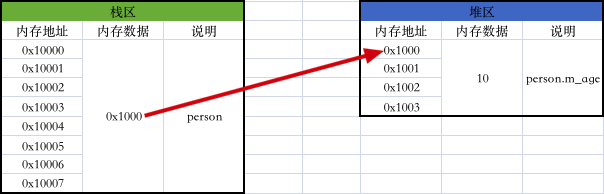
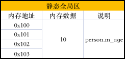

## 一、类、对象、成员变量、成员函数

#### 1、类、对象、成员变量、成员函数

C++里可以用struct关键字或class关键字定义一个类，比如：

```c++
#include <iostream>
using namespace std;

// 用struct关键字定义一个Person类
struct Person {
    // 成员变量
    int m_age;

    // 成员函数
    void run() {
        cout << m_age << " " << "run()" << endl;
    }
};

int main() {
    // 创建一个person对象
    Person person;
    person.m_age = 10;
    person.run(); // 10 run()
    
    return 0;
}
```

```c++
#include <iostream>
using namespace std;

// 用class关键字定义一个Person类
class Person {
public:
    // 成员变量
    int m_age;

    // 成员函数
    void run() {
        cout << m_age << " " << "run()" << endl;
    }
};

int main() {
    // 创建一个person对象
    Person person;
    person.m_age = 10;
    person.run(); // 10 run()
    
    return 0;
}
```

那用struct关键字和class关键字定义一个类有什么区别呢？

* 它俩唯一的区别就是用struct关键字定义的类默认的成员访问权限是public，而用class关键字定义的类默认的成员访问权限是private

那既然已经有class关键字了，为啥还要有struct关键字呢？

* 这主要是因为C里是用结构体来模拟类的效果的，所以为了向下兼容，也为了能让C开发者平滑过渡，C++里才保留了struct关键字，但在C++里我们不必把struct关键字当作结构体来看待，直接跟class关键字一样当作类来看待就可以了

推荐使用class关键字定义一个类，而非struct关键字定义一个类，因为class关键字毕竟是C++专门推出的语法。

#### 2、对象的内存大小、内存布局

C++里对象的内存大小，就按结构体变量的内存大小那样去分析就是对的。需要注意的是对象的内存大小只跟成员变量有关，只有成员变量的值才存储在对象内部，成员函数是存储在代码区的，所以成员函数不占用对象的内存。这也很好理解，不同对象的成员变量有不同的值，所以成员变量的值必须要存储在各自对象的内部，否则就没办法区分某个值到底是哪个对象的，而成员函数所有的对象调用的都是同一段代码，所以成员函数只需要在代码区存一份就够了，没必要每个对象里都存一份浪费内存。

```c++
#include <iostream>
using namespace std;

class Person {
public:
    int m_age;

    void run() {
        cout << m_age << " " << "run()" << endl;
    }
};

int main() {
    Person person;
  	// person对象m_age的值为10
    person.m_age = 10;
  	// person对象调用run成员函数
    person.run(); // 10 run()
    cout << sizeof(person) << endl; // 4
    
    Person person1;
    // person1对象m_age的值为20
    person1.m_age = 20;
    // person1对象调用run成员函数
    person1.run(); // 20 run()
    cout << sizeof(person1) << endl; // 4
    
    return 0;
}
```

其它语言里对象只能存在于堆区，而C++里对象可以存在于栈区、堆区、静态全局区。下面的代码中我们创建了一个栈区的person对象，它的内存布局大概如下：

```c++
#include <iostream>
using namespace std;

class Person {
public:
    int m_age;

    void run() {
        cout << m_age << " " << "run()" << endl;
    }
};

int main() {
    Person person;
  	// 对象访问成员变量和成员函数用.
    person.m_age = 10;
    person.run(); // 10 run()

    return 0;
}
```


下面的代码中我们创建了一个堆区的person对象，它的内存布局大概如下：

```c++
#include <iostream>
using namespace std;

class Person {
public:
    int m_age;

    void run() {
        cout << m_age << " " << "run()" << endl;
    }
};

int main() {
    Person *person = new Person();
  	// 对象指针访问成员变量和成员函数用->
    person->m_age = 10;
    person->run(); // 10 run()
    delete person;

    return 0;
}
```



下面的代码中我们创建了一个静态全局区的person对象，它的内存布局大概如下：

```c++
#include <iostream>
using namespace std;

class Person {
public:
    int m_age;

    void run() {
        cout << m_age << " " << "run()" << endl;
    }
};

Person person;

int main() {
    // 对象访问成员变量和成员函数用.
    person.m_age = 10;
    person.run(); // 10 run()

    return 0;
}
```



#### 3、this指针

上面我们说到“对象的内存大小只跟成员变量有关，只有成员变量的值才存储在对象内部，成员函数是存储在代码区的，所以成员函数不占用对象的内存”，也就是说下面的代码中10存储在person对象内部、20存储在person1对象内部，run成员函数存储在代码区只有一份，那么问题来了，既然run成员函数不存储在person对象和person1对象内部，那run成员函数执行体里是怎么知道person对象调用的时候就打印10、person1对象调用的时候就打印20的呢，也就是说代码区的run到底是怎么访问到person、person1这两块栈区的内存的呢？

```c++
#include <iostream>
using namespace std;

class Person {
public:
    int m_age;

    void run() {
        cout << m_age << " " << "run()" << endl;
    }
};

int main() {
    Person person;
    person.m_age = 10;
    person.run(); // 10 run()
    
    Person person1;
    person1.m_age = 20;
    person1.run(); // 20 run()
    
    return 0;
}
```

如果让我们自己实现，也很简单，那就是把调用run成员函数的那个对象作为参数传递给run成员函数——当然因为对象占用的内存可能比较大，所以建议通过指针的方式传递，避免过多地消耗栈内存——这样run成员函数执行体里就能知道是打印person对象的10还是打印person1对象的20了，如下：

```c++
#include <iostream>
using namespace std;

class Person {
public:
    int m_age;

    void run(Person *my_this) {
        cout << my_this->m_age << " " << "run()" << endl;
    }
};

int main() {
    Person person;
    person.m_age = 10;
    person.run(&person); // 10 run()
    
    Person person1;
    person1.m_age = 20;
    person1.run(&person1); // 20 run()

    return 0;
}
```

其实编译器就是这么做的，编译器已经帮我们做好了这件事，它会为每一个成员函数都添加一个隐式参数——this指针，外界某个对象通过点语法调用成员函数这种高级语言里的写法，在编译的时候编译器就是把外界这个对象的内存地址传递给成员函数的this指针，于是this指针就指向了成员函数的调用者，因此我们就可以在成员函数执行体里通过this指针来访问某个具体对象的成员变量、成员函数了，当然因为this是个指针，所以只能通过this->的方式来访问，而不能通过this.的方式来访问，当然我们也可以省略this直接访问，所有的面向对象语言里对象调用成员函数都是这么设计的。

```c++
#include <iostream>
using namespace std;

class Person {
public:
    int m_age;

    void run() {
        cout << this->m_age << " " << "run()" << endl;
    }
};

int main() {
    Person person;
    person.m_age = 10;
    person.run(); // 10 run()，可以理解为run(&person);
    
    Person person1;
    person1.m_age = 20;
    person1.run(); // 20 run()，可以理解为run(&person1);

    return 0;
}
```

#### 4、补充

###### 4.1 C++里堆内存的开辟和释放

C++里堆内存的开辟和释放有两组方式：malloc和free、new和delete，推荐使用new和delete，因为毕竟是C++专门推出的语法，new和delete内部会自动调用构造函数和析构函数，而malloc和free则不会。

* malloc和free

```c++
#include <iostream>
using namespace std;

void test() {
    // 在堆区开辟4个字节的内存，我们用整型指针来接收这块内存的首地址，代表我们想往这块内存里存储整型
    // 这里出现了指针，就一定有两块内存，局部变量p本身所对应的栈内存和4个字节的堆内存
    // 对于那块堆内存，我们只能拿到它的地址————即存储在局部变量p所对应的栈内存里，所以要操作那块堆内存就只能通过指针变量来操作了
    int *p = (int *)malloc(4);
    if (p == NULL) {
        cout << "开辟堆内存失败" << endl;
        return;
    }
    // 我们知道拿到p就是拿到了那块堆内存的地址，拿到*p就是拿到那块堆内存的值
    *p = 10;
    // 读取这块内存里的数据
    cout << "堆内存：" << *p << endl; // 堆内存：10
    
    // 释放堆内存
    free(p);
    // free函数调用后堆内存是释放了，但指针变量p还是指向那段堆内存的，也就是说是个野指针，所以要把指针赋值为NULL避免野指针
    p = NULL;
}
```

```c++
#include <iostream>
using namespace std;

void test() {
    // 在堆区开辟4个字节的内存，我们用char类型指针来接收这块内存的首地址，代表我们想往这块内存里存储char类型，但是因为char类型只占1个字节，不足4个字节，所以这里其实代表的是开辟了一个char数组、能存放4个元素
    // 这里出现了指针，就一定有两块内存，局部变量p本身所对应的栈内存和4个字节的堆内存
    // 对于那块堆内存，我们只能拿到它的地址————即存储在局部变量p所对应的栈内存里，所以要操作那块堆内存就只能通过指针变量来操作了
    char *p = (char *)malloc(4);
    if (p == NULL) {
        cout << "开辟堆内存失败" << endl;
        return;
    }
    // 我们知道拿到p就是拿到了那块堆内存的地址，拿到*p就是拿到那块堆内存的值
    *p = 10;
    *(p + 1) = 20;
    *(p + 2) = 30;
    *(p + 3) = 40;
//    p[0] = 10;
//    p[1] = 20;
//    p[2] = 30;
//    p[3] = 40;
    // 读取这块内存里的数据
    cout << "堆内存：" << *p << *(p + 1) << *(p + 2) << *(p + 3)<< endl; // 堆内存：10 20 30 40
//    cout << "堆内存：" << p[0] << p[1] << p[2] << p[3] << endl; // 堆内存：10 20 30 40
    
    // 释放堆内存
    free(p);
    // free函数调用后堆内存是释放了，但指针变量p还是指向那段堆内存的，也就是说是个野指针，所以要把指针赋值为NULL避免野指针
    p = NULL;
}
```

* new和delete

```c++
#include <iostream>
using namespace std;

void test() {
    // 只要一见到new，那就必然是在堆区开辟内存，new后面跟着什么类型就代表我们想往这块内存里存储什么类型的数据，这里是在堆区开辟sizeof(int)个字节的内存，我们用整型指针来接收这块内存的首地址
    // 这里出现了指针，就一定有两块内存，局部变量p本身所对应的栈内存和4个字节的堆内存
    // 对于那块堆内存，我们只能拿到它的地址————即存储在局部变量p所对应的栈内存里，所以要操作那块堆内存就只能通过指针变量来操作了
    int *p = new int();
    if (p == NULL) {
        cout << "开辟堆内存失败" << endl;
        return;
    }
    // 我们知道拿到p就是拿到了那块堆内存的地址，拿到*p就是拿到那块堆内存的值
    *p = 10;
    // 读取这块内存里的数据
    cout << "堆内存：" << *p << endl; // 堆内存：10
    
    // 释放堆内存
    delete p;
    // delete调用后堆内存是释放了，但指针变量p还是指向那段堆内存的，也就是说是个野指针，所以要把指针赋值为NULL避免野指针
    p = NULL;
}
```

```c++
#include <iostream>
using namespace std;

void test() {
    // 只要一见到new []，那就必然是在堆区开辟内存，new和[]中间夹着什么类型就代表我们想往这块数组内存里存储什么类型的数据，这里是在堆区开辟sizeof(char) * 4个字节的内存，我们用char类型指针来接收这块内存的首地址
    // 这里出现了指针，就一定有两块内存，局部变量p本身所对应的栈内存和4个字节的堆内存
    // 对于那块堆内存，我们只能拿到它的地址————即存储在局部变量p所对应的栈内存里，所以要操作那块堆内存就只能通过指针变量来操作了
    char *p = new char[4]();
    if (p == NULL) {
        cout << "开辟堆内存失败" << endl;
        return;
    }
    // 我们知道拿到p就是拿到了那块堆内存的地址，拿到*p就是拿到那块堆内存的值
    *p = 10;
    *(p + 1) = 20;
    *(p + 2) = 30;
    *(p + 3) = 40;
//    p[0] = 10;
//    p[1] = 20;
//    p[2] = 30;
//    p[3] = 40;
    // 读取这块内存里的数据
    cout << "堆内存：" << *p << *(p + 1) << *(p + 2) << *(p + 3)<< endl; // 堆内存：10 20 30 40
//    cout << "堆内存：" << p[0] << p[1] << p[2] << p[3] << endl; // 堆内存：10 20 30 40
    
    // 释放堆内存
    delete[] p;
    // delete调用后堆内存是释放了，但指针变量p还是指向那段堆内存的，也就是说是个野指针，所以要把指针赋值为NULL避免野指针
    p = NULL;
}
```

