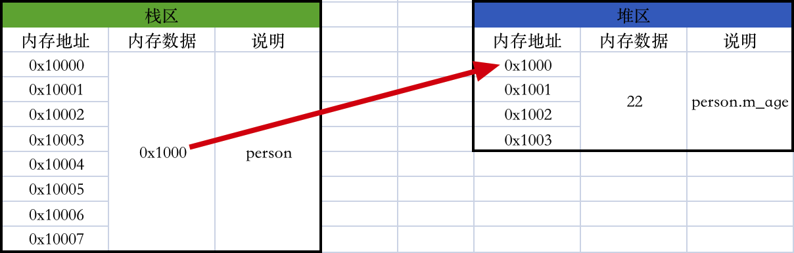
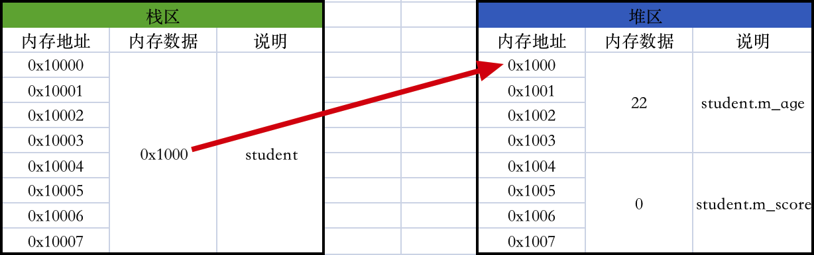

## 二、封装、继承、多态

#### 1、封装

封装是指成员变量私有化，然后提供公开的setter方法和getter方法供外界访问成员变量，是一个针对成员变量的特性。

```c++
#include <iostream>
using namespace std;

class Person {
    int m_age;

public:
    void setAge(int age) {
        if (age < 0) {
            m_age = 0;
        } else {
            m_age = age;
        }
    }
    
    int getAge() {
        return m_age;
    }
};

int main() {
    Person person;
    person.setAge(-10);
    cout << person.getAge() << endl; // 0
    
    return 0;
}
```

#### 2、继承

继承是指子类拥有了父类所有的成员变量、成员函数、构造函数、析构函数，是一个针对成员变量、成员函数的特性。用`:`来实现，注意C++里没有规定所有的类都必须继承自某个基类，只要一个类没有父类，那它就是一个基类。

```c++
#include <iostream>
using namespace std;

// 父类
class Person {
public:
    int m_age;
    
    void run() {
        cout << m_age << " " << "run()" << endl;
    }
    
    Person() {
        cout << "Person()" << endl;
        
        m_age = 0;
    }
    
    ~Person() {
        cout << "~Person()" << endl;
    }
};

// 子类
class Student : public Person {
public:
    int m_no;
    
    void study() {
        cout << m_no << " " << "study()" << endl;
    }
    
    Student() {
        cout << "Student()" << endl;
        
        m_no = 0;
    }
    
    ~Student() {
        cout << "~Student()" << endl;
    }
};

int main() {
    Person *person = new Person();
    person->m_age = 18;
    person->run();
    delete person;
    
    Student *student = new Student();
    student->m_age = 18;
    student->run();
    student->m_no = 9;
    student->study();
    delete student;
    
    return 0;
}
```

###### 2.1 构造函数和析构函数的补充

* 子类的构造函数里会在第一行默认调用父类的无参构造函数，子类的析构函数里会在最后一行默认调用父类的析构函数（其实很多语言里都是这么设计的，目的就是为了保证子类继承自父类的那些成员变量能够被正常初始化和释放掉）

```c++
#include <iostream>
using namespace std;

class Person {
public:
    Person() {
        cout << "Person()" << endl;
    }
    
    ~Person() {
        cout << "~Person()" << endl;
    }
};

class Student : public Person {
public:
    Student() {
        cout << "Student()" << endl;
    }
    
    ~Student() {
        cout << "~Student()" << endl;
    }
};

int main() {
    Student *student = new Student();
    delete student;
    
    // 控制台打印顺序：
    // Person()
    // PStudent()
    // P~Student()
    // P~Person()
    
    return 0;
}
```

* 我们当然也可以显性地让子类调用了父类的构造函数，析构函数只能默认调用不能显性调用

```c++
#include <iostream>
using namespace std;

class Person {
public:
    int m_age;
    
    Person(int age) {
        cout << "Person(int age)" << endl;
        
        m_age = age;
    }
    
    Person() {
        cout << "Person()" << endl;
        
        m_age = 0;
    }
    
    ~Person() {
        cout << "~Person()" << endl;
    }
};

class Student : public Person {
public:
  	// 显示地调用父类的全能构造函数
    Student() : Person(18) {
        cout << "Student()" << endl;
    }
    
  	// 显示地调用父类的无参构造函数
//    Student() : Person() {
//        cout << "Student()" << endl;
//    }
    
    ~Student() {
        cout << "~Student()" << endl;
    }
};

int main() {
    Student *student = new Student();
    delete student;
    
    // 控制台打印顺序：
    // Person(int age)
    // PStudent()
    // P~Student()
    // P~Person()
    
    return 0;
}
```

* 因此当我们的父类里只有全能构造函数没有无参构造函数时，编译器就没法自动帮我们调用无参构造函数了，我们就只能显性调用一下全能构造函数了

```c++
#include <iostream>
using namespace std;

class Person {
public:
    int m_age;
    
    Person(int age) {
        cout << "Person(int age)" << endl;
        
        m_age = age;
    }
    
    ~Person() {
        cout << "~Person()" << endl;
    }
};

class Student : public Person {
public:
  	// 显示地调用父类的全能构造函数
    Student() : Person(18) {
        cout << "Student()" << endl;
    }
    
    ~Student() {
        cout << "~Student()" << endl;
    }
};

int main() {
    Student *student = new Student();
    delete student;
    
    // 控制台打印顺序：
    // Person(int age)
    // PStudent()
    // P~Student()
    // P~Person()
    
    return 0;
}
```

###### 2.2 成员函数重写

C++里子类重写父类里的函数直接写就行，怎么调用父类的成员函数呢？调用父类的虚函数有虚函数表直接放在自己内部了，调用父类的非虚函数只能显式地“Person::run();”调用了，直接写“run()”是调用自己的run吗，那C++里没有super关键字和superclass这种指针，而且也不像Swift那样会把非虚函数也存储自己内部，所以调用父类的非虚函数只能显式地“Person::run();”调用了，C++里所有的非虚函数都是直接存储在代码区跟对象毫无关联的，只有调用时传进去一个对象才有了关联，而虚函数同样存储在代码区，但因为虚函数表的存在而跟对象有关联。

```c++
#include <iostream>
using namespace std;

class Person {
public:
    int m_age;
    
    void run() {
        cout << m_age << " " << "Person::run()" << endl;
    }
};

class Student : public Person {
public:
    void run() {
        Person::run();
        cout << m_age << " " << "Student::run()" << endl;
    }
};

int main() {
    Student *student = new Student();
    student->m_age = 18;
    student->run();
    delete student;
    
    return 0;
}
```

#### 3、多态

多态是指子类重写父类的成员函数、然后父类指针指向子类对象、然后用父类指针调用子类重写的成员函数，不同的子类就会产生不同的执行结果，是一个针对成员函数的特性。

###### 3.1 虚函数与虚函数表

在其它很多语言里多态都是默认行为，而在C++里多态不是默认行为，也就是说在其它很多语言里下面的“person1->run();”会自动打印“Teacher::run()”、“person2->run();”会自动打印“Student::run()”，而在C++里它们却都打印了“Person::run()”。

```c++
#include <iostream>
using namespace std;

class Person {
public:
    void run() {
        cout << "Person::run()" << endl;
    }
};

class Teacher : public Person {
public:
    void run() {
        cout << "Teacher::run()" << endl;
    }
};

class Student : public Person {
public:
    void run() {
        cout << "Student::run()" << endl;
    }
};

int main() {
    Person *person = new Person();
    person->run(); // Person::run()
    delete person;
    
    Person *person1 = new Teacher();
    person1->run(); // Person::run()
    delete person1;
    
    Person *person2 = new Student();
    person2->run(); // Person::run()
    delete person2;
    
    return 0;
}
```

C++里要想实现多态得用virtual关键字修饰一下成员函数，被virtual关键字修饰的成员函数被称为虚函数，注意一个成员函数只要在父类里被声明为虚函数，那子类里重写的该成员函数也会自动变成虚函数（也就是说子类里可以省略virtual关键字）。

```c++
#include <iostream>
using namespace std;

class Person {
public:
    // 用virtual关键字修饰一下成员函数，变成虚函数
    virtual void run() {
        cout << "Person::run()" << endl;
    }
};

class Teacher : public Person {
public:
    // 默认就是虚函数
    void run() {
        cout << "Teacher::run()" << endl;
    }
};

class Student : public Person {
public:
    // 默认就是虚函数
    void run() {
        cout << "Student::run()" << endl;
    }
};

int main() {
    Person *person = new Person();
    person->run(); // Person::run()
    delete person;
    
    Person *person1 = new Teacher();
    person1->run(); // Teacher::run()
    delete person1;
    
    Person *person2 = new Student();
    person2->run(); // Student::run()
    delete person2;
    
    return 0;
}
```

那虚函数的原理是什么呢？它为什么能实现多态？这就要说到C++里成员函数的调用流程了，虚函数的实现原理是虚函数表，虚函数是实现多态的手段，这个手段的原理又是虚函数表：

* 直接调用：我们知道代码在编译完之后每个函数都会有一个唯一的符号、并且对应着代码区一个唯一的地址，比如上面没有虚函数的例子，Person类的run函数的唯一符号是\_Person::run、对应代码区的唯一地址为0x00，Teacher类的run函数的唯一符号是\_Teacher::run、对应代码区的唯一地址为0x01，Student类的run函数的唯一符号是Student::run、对应代码区的唯一地址为0x02，这样的映射关系术语叫符号表，也是存放在代码区，那么编译器在看到“person->run();”这样的代码时会先看一下person的指针类型，发现是个“Person *”的指针类型，于是编译器就判定为我们是要调用Person类的run函数，即\_Person::run这个符号对应的函数，于是就去代码区的符号表里找到这一对映射，顺利拿到函数的地址，然后直接翻译成汇编bl 0x00去执行相应的函数， “person1->run();”、“person2->run();”也是同理的，编译器默认情况下只会看person1和person2是什么类型的指针，从而决定调用哪个类的方法，不会去关心后面到底是什么类型的对象，其实直接调用是绝大多数情况下的函数调用方式，所有的函数调用都是如此，不限于成员函数

* 间接调用：经过一堆指令，得出到底应该调用哪个类的成员函数，然后把这个函数地址放到寄存器里，然后从寄存器里拿出函数地址来去调用相应的成员函数，虚函数就是这么调用的

  * 下面这段代码里是没有虚函数的，Person对象占用4个字节，Student对象占用8个字节，这很好理解，因为Person类只有一个int类型的成员变量m_age，Student类有两个int类型成员变量m_age、m_score，main函数里代码的内存图也很简单如下：

    ```c++
    #include <iostream>
    using namespace std;
    
    class Person {
    public:
        int m_age;
        
        void run() {
            cout << "Person::run()" << endl;
        }
        
        void eat() {
            cout << "Person::run()" << endl;
        }
    };
    
    class Student : public Person {
    public:
        int m_score;
        
        void run() {
            cout << "Student::run()" << endl;
        }
        
        void eat() {
            cout << "Student::run()" << endl;
        }
    };
    
    int main() {
        cout << sizeof(Person) << endl; // 4
        Person *person = new Person();
        person->m_age = 22;
        
        cout << sizeof(Student) << endl; // 8
        Person *person1 = new Student();
        person1->m_age = 12;
        
        return 0;
    }
    ```

    

    

  * 下面这段代码里是有虚函数的，Person对象竟然占用4 + 12 = 16个字节，Student对象也占用8 + 8 = 16个字节，（Person类一会再说），其实有了虚函数之后Student对象会在所有的成员变量前面加一个指——即虚函数表指针——64位CPU下一个指针占用8个字节嘛，所以才多了8个字节，这样main函数里代码的内存图也很简单如下：

    ```c++
    #include <iostream>
    using namespace std;
    
    class Person {
    public:
        int m_age;
        
        virtual void run() {
            cout << "Person::run()" << endl;
        }
        
        virtual void eat() {
            cout << "Person::run()" << endl;
        }
    };
    
    class Student : public Person {
    public:
        int m_score;
        
        void run() {
            cout << "Student::run()" << endl;
        }
        
        void eat() {
            cout << "Student::run()" << endl;
        }
    };
    
    int main() {
        cout << sizeof(Person) << endl; // 4 + 12 = 16
        Person *person = new Person();
        person->m_age = 22;
        
        cout << sizeof(Student) << endl; // 8 + 8 = 16
        Person *person1 = new Student();
        person1->m_age = 12;
        
        return 0;
    }
    ```

    

    那是怎么调用的呢？此时编译器就不只看指针了，还会看指针指向的对象，这个是怎么做到的？（那就是看这个类有没有虚函数，一旦有虚函数那么虚函数的调用就会走续表这套流程，非虚函数还是直接调用——即如果发现是调用虚函数那就走虚函数表那一套流程，如果发现调用的不是虚函数那还是直接调用，因为Person类型里有虚函数了，所以Person *person1 = new Student();编译器一看到Person *指针，先去看看Person *有没有续表，发现有那就会去看对象到底是什么了，而如果Person类里没有虚函数，那肯定就是直接调用，所以这一切的关键点就在于一个类里有没有用virtual关键字修饰一下成员函数——即有没有虚函数）找到对象当然就能找到虚函数表，找到虚函数表当然就能找到函数来调用了，

    

    需要生成一堆汇编指令，而不是只生成一条bl指令

    

    编译器一旦发现一个类里只要有虚函数，那么它对应对象的内存结构里就会多出8个字节的虚函数表，那么后续但凡跟这种对象相关的成员函数调用就会走虚函数表那一套了，不管你是父类指针调用还是自己类的指针调用（汇编可以验证），但需要注意的是虚函数表里存储的不直接是成员函数的地址，而是调用地址——可以理解为成员函数地址mask后的一个地址、总之能根据这个调用地址找到成员函数的地址

    

    所以我们看一把这个虚函数表指针就像是为类增加一个成员变量一样，只要有虚函数，那么这个这个类就会多一个隐式的虚函数表指针成员变量，确实它创建出来的对象占用的内存大了嘛，Student类会有自己的虚函数指针成员变量，所有的Student对象会指向同一个代码区的Student类的虚函数表，Teacher类也会有自己的虚函数指针成员变量，所有的Teacher对象会指向同一个代码区的Teacher类的虚函数表。这种感觉就像是我们的代码一编译完Student类的唯一一张虚函数表就确定了，而且它的虚函数指针成员变量默认赋值Student类的虚函数表的地址，接下来我们创建的每一个Student对象就自动拥有了一个已经赋好值的成员变量，以后直接拿着用就行，Teacher类也是同理，每一个有虚函数的类也是同理。

    

    怎么调用父类的虚函数呢——也就是子类没有重写父类的那些虚函数？我们知道子类内部也没有存储superclass这种父类的指针，那是怎么找到父类的呢？这个跟Swift很像，其实是把父类的虚函数直接放到自己的虚函数表里了，这个可以跟上面的例子混合起来举一个完整的例子。注意这只是针对虚函数，非虚函数子类不会存的，这就是上面重写那里说的怎么调用父类的方法了。调用父类的虚函数有虚函数表直接放在自己内部了，调用父类的非虚函数只能显式地调用了，C++里没有super关键字和superclass这种指针，而且也不像Swift那样会把非虚函数也存储自己内部，C++里所有的非虚函数都是直接存储在代码区跟对象毫无关联的，只有调用时传进去一个对象才有了关联，而虚函数同样存储在代码区，但因为虚函数表的存在而跟对象有关联。

    

    这个OC对象里有isa、Swift对象里有类型信息很像，调用什么完全由对象决定，而不是由类型决定，默认永远都是需要走一套调用流程最终再调用相应的函数的，这也是为啥它们默认支持多态的原因，而C++里普通的成员函数是直接调用的、是不支持多态的，只有虚函数是间接调用的、是支持多态的。

###### 3.2 虚析构函数

上面的代码中，Student对象的析构函数没有调用，这也很好理解，因为我们没有用虚函数，所以析构函数调用只看等号左边的指针是什么类型从而决定调用谁的析构函数，也就是说这个多态是错误的实现，当然会导致错误的结果了。

```c++
#include <iostream>
using namespace std;

class Person {
public:
    Person() {
        cout << "Person::Person()" << endl;
    }
    
    ~Person() {
        cout << "Person::~Person()" << endl;
    }
};

class Student : public Person {
public:
    Student() {
        cout << "Student::Student()" << endl;
    }
    
    ~Student() {
        cout << "Student::~Student()" << endl;
    }
};

int main() {
    Person *person = new Student();
    delete person;
    
    // 控制台打印：
    // Person::Person()
    // Student::Student()
    // Person::~Person()
    
    return 0;
}
```

那我们用虚函数搞一把，C++设计构造函数不能被搞成虚函数，只有析构函数才能被搞成虚函数，下面的代码就正确了，这也很好理解，因为我们用了虚函数，所以编译器会看等号右边到底是什么类型的对象，从而决定调用谁的析构函数，而子类的析构函数会默认调用父类的析构函数，所以两个析构函数都打印了，这个多态才是正确的实现，也就是说当我们使用多态时一定要记得把析构函数搞成虚函数——即虚析构函数，避免内存泄漏。

```c++
#include <iostream>
using namespace std;

class Person {
public:
    Person() {
        cout << "Person::Person()" << endl;
    }
    
    virtual ~Person() {
        cout << "Person::~Person()" << endl;
    }
};

class Student : public Person {
public:
    Student() {
        cout << "Student::Student()" << endl;
    }
    
    ~Student() {
        cout << "Student::~Student()" << endl;
    }
};

int main() {
    Person *person = new Student();
    delete person;
    
    // 控制台打印：
    // Person::Person()
    // Student::Student()
    // Student::~Student()
    // Person::~Person()
    
    return 0;
}
```

#### 4、抽象类、接口

没有执行体且初始化为0的虚函数被称为纯虚函数，纯虚函数一般用在抽象类里面。

```c++
class Person {
public:
    int m_age;
    
  	// 纯虚函数
    virtual void work() = 0;
};
```

只要有一个纯虚函数，那么这个类就是一个抽象类，抽象类最大的特点就是不能实例化，一般就是用来给定义一些成员变量和抽象函数——纯虚函数，供子类去实现，当然也可以定义非抽象函数但我们一般不会这么去搞，抽象类本来就是想搞点成员变量和抽象函数供子类去实现，当然如果我们像实现接口，那抽象类里没有成员变量只有抽象函数，这不就是接口了嘛。C++里只有抽象类，没有直接的接口，Java里既有抽象类也有接口的，OC里只有接口没有直接的抽象类、但绑定对象不就是抽象类了嘛，只是Java直接把抽象类和接口分得很清而已，Java里的接口跟OC里的协议是一个功能，但跟抽象类不是一个功能，最明显的区别就是抽象类可以定义成员变量，而接口和协议只能定义函数。如果父类是抽象类，而子类没有完全重写父类的抽象函数，那么这个子类依然是个抽象类。

```c++
#include <iostream>
using namespace std;

class Person {
public:
    int m_age;
    
    // 纯虚函数
    virtual void work() = 0;
    
    virtual void run() {
        cout << "Person::run()" << endl;
    }
    
    virtual void eat() {
        cout << "Person::run()" << endl;
    }
};

class Student : public Person {
public:
    void work() {
        cout << "Student::run()" << endl;
    }
    
    void run() {
        cout << "Student::run()" << endl;
    }
    
    void eat() {
        cout << "Student::run()" << endl;
    }
};

class Teacher : public Person {
public:
    void work() {
        cout << "Teacher::run()" << endl;
    }
    
    void run() {
        cout << "Teacher::run()" << endl;
    }
    
    void eat() {
        cout << "Teacher::run()" << endl;
    }
};

int main() {
//    Person *person = new Person(); // 抽象类不能实例化

    return 0;
}
```


